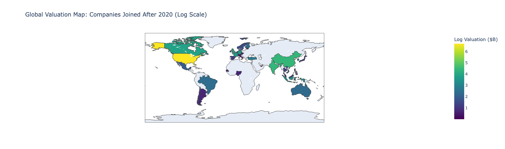

# Global Unicorn Valuation – Exploratory Data Analysis

A deep dive into the world of unicorn startups to explore regional growth patterns, investor trends, and time-to-unicorn insights across global markets.

---

## What I Did

- Cleaned and preprocessed a global unicorn dataset (valuation, funding, time-based features)
- Handled missing data and standardized funding amounts
- Engineered features: `Time to Unicorn`, `Valuation ($B)`, `Funding (M)`
- Created global valuation maps and city-level breakdowns
- Analyzed investor patterns, funding distribution, and industry/city trends
- Visualized AI and hardware company locations for targeted insights

---

## Key Insights

- The US and China dominate unicorn valuation—but Europe and Southeast Asia are growing fast
- **Hardware companies** are most concentrated in **Beijing**, **San Francisco**, and **London**
- Time-to-unicorn is shrinking in high-growth sectors like AI and Fintech
- Investor activity is highly concentrated—just a few firms dominate unicorn backing
- **Missing funding data** was a significant factor and required thoughtful treatment

---

## Visual Preview

> *Map showing total log-transformed unicorn valuations for companies that joined after 2020.*

---

## Full Story & Business Context

👉 [Read the full story on Notion](https://www.notion.so/Global-Unicorn-Valuation-Capstone-Project-1cc9764c6006809f8a7fc855e61fbdf1?pvs=4)

Includes:
- Executive summary
- Business takeaways
- Stakeholder-ready charts & commentary